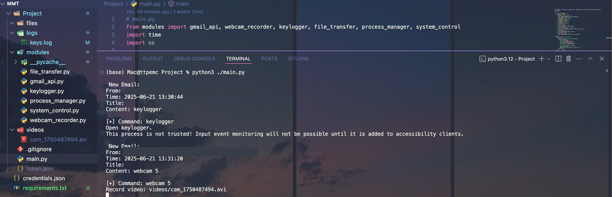

# 🛡️ HCMUS-MMT Monitoring Toolkit

<p align="center">
  <em>An academic project for HCMUS - Information Security course (MMT)</em><br>
  <strong>Keylogger • Gmail Exfiltration • Webcam Recorder • Modular Design</strong>
</p>

<p align="center">
  
  
  
</p>

---

## ✨ Features

| Module           | Description                                 |
|------------------|---------------------------------------------|
| `keylogger`      | Captures keystrokes silently and logs them  |
| `webcam_recorder`| Records webcam feed via OpenCV              |
| `gmail_api`      | Sends logs/files via Gmail using Google API |
| `scheduler`      | Modular main loop, scheduled task runners   |

---

## 🧱 Folder Structure

```
HCMUS-MMT/
├── modules/
│   ├── keylogger.py
│   ├── webcam.py
│   └── gmail_api.py
├── videos/
│   └── main.py
├── credentials.json        # Your Gmail OAuth credentials
├── token.json              # Your token
├── .gitignore
├── requirements.txt
└── README.md
```

---

## 🚀 How to Run

1. **Install dependencies**

```bash
pip install -r requirements.txt
```

2. **Run the main script**

```bash
cd Project
python main.py
```

3. **Google API setup**

- Enable Gmail API: [Google Cloud Console](https://console.cloud.google.com/)
- Put your `credentials.json` in the root folder
- Token will be generated automatically upon first run

---

## 🎥 Demo


---

## ⚠️ Disclaimer

> This repository is intended for **educational purposes only** (academic coursework at HCMUS).  
> Do **NOT** use this code for any unethical or illegal activities.  
> Please respect others' privacy and comply with local laws.

---

## 🧠 Credits

- Project by: `Trinh Tan Phat` & teammates  
- Course: **Information Security - HCMUS**

---

## 📜 License

This project is licensed under the [MIT License](LICENSE).
